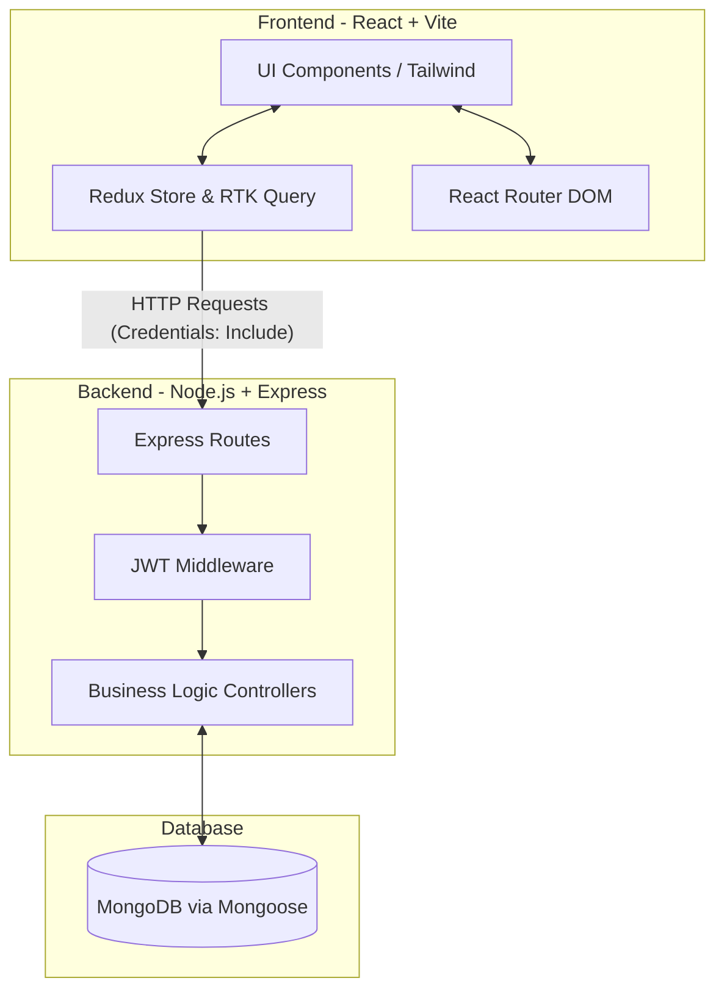

#  Tasky - Task Management Platform


Tasky is a professional, task management platform built with the MERN stack. Designed with a focus on high performance, modern UI/UX aesthetics, and scalable architecture, Tasky provides teams with an intuitive environment to organize, track, and complete their work efficiently.


---

## Features

### Advanced Role-Based Access Control (RBAC)
Tasky implements a strict 3-tier hierarchy to ensure organizational security:
*   **Super Admin (`admin@gmail.com`)**: Full system control. Can promote/demote other users and retains ultimate authority over team management.
*   **Administrator**: Can create, manage, and assign tasks across the team. Cannot modify the roles of other administrators.
*   **Team Member**: Focused, distraction-free environment. Can only view and update tasks specifically assigned to them.

### Professional UI/UX & Interactivity
*   **Zero-Latency Drag & Drop**: Move tasks between stages ("To Do", "In Progress", "Completed") on the interactive Board View. Powered by optimistic UI updates, the interface responds instantly without waiting for network requests.

*   **Modern Aesthetics**: Built with Tailwind CSS, featuring subtle glassmorphism, fluid Framer Motion animations, and responsive mobile drawers.

*   **Advanced Voice Commands**: Use browser-native voice recognition to control the entire application hands-free. Click the microphone icon and try saying:
    *   **"Create task [name]"** - Opens the task creation modal pre-filled with your task name.
    *   **"Search for [keyword]"** - Instantly filters your view for specific terms.
    *   **"Move [task] to in progress"** - Magically moves a task across the board via API.
    *   **"Mark [task] as completed"** - Instantly closes out a task.
    *   **"Switch to list view"** - Toggles the layout instantly.
    *   **"Export tasks"** - Triggers a CSV download of your current view.

*   **Automated Overdue Tracking**: The system intelligently calculates overdue tasks and surfaces them on a dedicated dashboard tab.


## Architecture Diagram



## 💻 Tech Stack

**Frontend Architecture:**
*   **Framework**: React 18 + Vite (for lightning-fast HMR and optimized builds)
*   **State Management**: Redux Toolkit & RTK Query
*   **Styling & UI**: Tailwind CSS, Headless UI, Framer Motion
*   **Interactions**: `@hello-pangea/dnd` (Drag & Drop), `sonner` (Toast notifications)
*   **Routing**: React Router DOM v6

**Backend Architecture:**
*   **Runtime**: Node.js
*   **Framework**: Express.js
*   **Database**: MongoDB & Mongoose ORM
*   **Security**: JSON Web Tokens (JWT), bcryptjs, Cookie-Parser

---

## 🚀 Getting Started

### Prerequisites
*   Node.js (v16 or higher)
*   MongoDB instance (local or Atlas cluster)

### 1. Clone the repository
```bash
git clone https://github.com/Naman317/Tasky.git
cd Tasky
```

### 2. Backend Setup
1. Navigate to the server directory:
   ```bash
   cd server
   ```
2. Install dependencies:
   ```bash
   npm install
   ```
3. Create a `.env` file in the `server` directory and add the following variables:
   ```env
   PORT=8800
   MONGODB_URI=your_mongodb_connection_string
   JWT_SECRET=your_super_secret_jwt_key
   NODE_ENV=development
   ```
4. Start the development server:
   ```bash
   npm start
   ```

### 3. Frontend Setup
1. Open a new terminal and navigate to the client directory:
   ```bash
   cd client
   ```
2. Install dependencies:
   ```bash
   npm install
   ```
3. Create a `.env` file in the `client` directory:
   ```env
   VITE_APP_BASE_URL=http://localhost:8800/api
   ```
4. Start the Vite development server:
   ```bash
   npm run dev
   ```

---

## 📖 Application Structure

```text
├── client/
│   ├── src/
│   │   ├── components/      # Reusable UI elements & Modals
│   │   ├── pages/           # Route-level components (Tasks, Dashboard, Users)
│   │   ├── redux/           # Global state slices & RTK Query API endpoints
│   │   └── utils/           # Helper functions (date formatting, etc.)
│   └── package.json
│
├── server/
│   ├── controllers/         # Business logic for Users and Tasks
│   ├── middlewares/         # JWT Verification & RBAC protection
│   ├── models/              # Mongoose Database Schemas
│   ├── routes/              # Express API route definitions
│   └── index.js             # Server entry point
```

---

## 🤝 Contribution Guidelines
This project adheres to professional SDE 2 standards. When contributing:
1. Ensure API calls are added to `apiSlice` rather than using direct Axios calls where possible.
2. Maintain the established Tailwind CSS design system.
3. Keep the 3-tier role architecture in mind when exposing new backend endpoints.

This project is made with curiosity by Naman .
